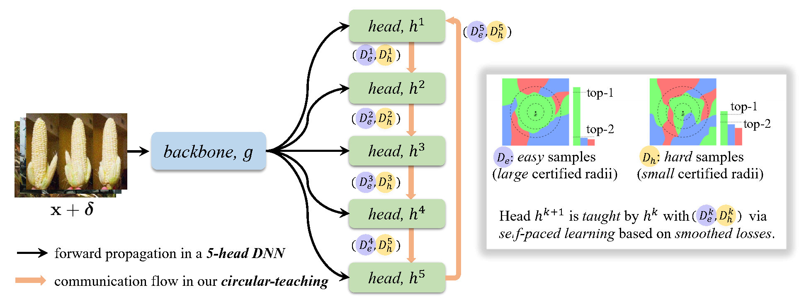

# On Multi-head Ensemble of Smoothed Classifiers for Certified Robustness

This is the official code repo for the paper entitled `On Multi-head Ensemble of Smoothed Classifiers for Certified Robustness`.

## SPACTE in a nutshell

The proposed **SPACTE** in our paper is an efficient and effective certifiably-robust defense. SPACTE augments an individual DNN with multiple heads, each of which pertains a classifier for the ensemble. Particularly, SPACTE enables a circular communication flow among those augmented heads, *i.e.*, each head teaches its neighbor with the self-paced learning using smoothed losses, which are specifically designed in relation to certified robustness.

The deployed multi-head structure and the circular-teaching scheme of SPACTE jointly contribute to diversify and enhance the classifiers in augmented heads for ensemble, leading to even stronger certified robustness than ensembling multiple DNNs (*effectiveness*) at the cost of much less computational expenses (*efficiency*).

<!-- <a href="pics/figure.pdf"></a> -->
<a href="pics/figure.pdf"><div align="center"></div></a>

## Overview of the Repo

SPACTE is compatible with all single-model-based certified defenses, among which 3 representative defenses are selected:
- Gaussian (ICML'19): the pioneering work on randomized-smoothing. [[paper](https://arxiv.org/abs/1902.02918), [code](https://github.com/locuslab/smoothing)]
- Consistency (NeurIPS'20): the SOTA regularization-based certified defense. [[paper](https://arxiv.org/abs/2006.04062), [code](https://github.com/jh-jeong/smoothing-consistency)]
- SmoothMix (NeurIPS'21): the SOTA data-augmentation-based certified defense. [[paper](https://arxiv.org/abs/2111.09277), [code](https://github.com/jh-jeong/smoothmix)]

Accordingly, this repo is organized based on the 3 defenses.
- [codes/](./codes/) contains the codes for training SPACTE with base methods Gaussian ([codes/0Gaussian/](./codes/0Gaussian)), Consistency ([codes/1Consistency/](./codes/1Consistency)) and SmoothMix ([codes/2SmoothMix/](./codes/2SmoothMix)), respectively.
- [logs_certification/](./logs_certification) provides the corresponding certification log data of our SPACTE.

For example, take a close look at the files in [codes/0Gaussian/](./codes/0Gaussian):
1. `model/*_mhead.py`: model definitions of the multi-head DNN
2. `circular_teaching.py`: main code sof SPACTE
3. `core_mhead.py`: smoothed classifier of the multi-head DNN
4. `certify_mhead.py`: certification script
5. `train.py`: training script
6. `utils.py`: utility functions

## Getting started
1. `git clone https://github.com/fanghenshaometeor/Circular-teaching.git`
2. Install dependencies
```
conda create -n spacte python=3.6
conda activate spacte
conda install pytorch torchvision cudatoolkit=11.3 -c pytorch # for Linux
pip install pandas, scipy, statsmodels, tensorboard
```

## Examples
Let us see an example how to train and certifiy a 5-head ResNet-110 via SPACTE upon Gaussian baseline on CIFAR10 with a noise level $\sigma=0.25$.

### Training and certification
```
cd Circular-teaching
cd codes/0Gaussian

CUDA_VISIBLE_DEVICES=0 python train.py --arch R110 --dataset CIFAR10 --data_dir $data_dir$ --noise_sd 0.25 --num_heads 5 --num_noise_vec 2 --lbdlast 1.2

CUDA_VISIBLE_DEVICES=0 python certify_mhead.py --arch R110 --dataset CIFAR10 --data_dir $data_dir$ --model_path './save/CIFAR10/R110/noise-0.25/h-5-eps-0.8-m-2-lbdlast-1.2/epoch150.pth' --noise_sd 0.25 --skip 20 --num_heads 5
```
- By running the `train.py` script, the models are by default saved in the created folder `./save/CIFAR10/R110/noise-0.25/h-5-eps-0.8-m-2-lbdlast-1.2/`. In addition, two folders `./logs/` and `./runs/` are also created to record the training information.
- By running the `certify_mhead.py` script, the corresponding logs are by default saved in the created folder `./logs/CIFAR10/R110/noise-0.25/certify-mhead/`, including the detailed certified radius on each sample, the ACR and the approximated certified accuracy at given radii.

A full collection of all the training and certification commands can be found in [EXPERIMENTS.md](./EXPERIMENTS.md).

## Pre-trained models

## References